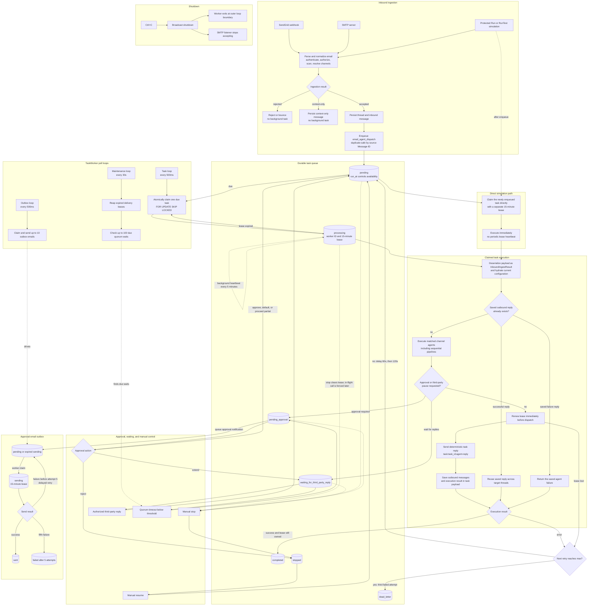

# Mail Agents Server

An email agent automation platform built in Rust.

## 1. System Architecture Overview

The system operates as an asynchronous, event-driven pipeline mapping standard SMTP/IMAP email traffic into a stateful LLM context window, executing agentic workflows, and proxying the output back to human clients via properly threaded outbound SMTP.

### 1.1 Core Subsystems

- **Inbound Mail Transfer Agent (MTA) / Webhook Gateway:** Listens for incoming traffic, terminating the SMTP connection and passing raw MIME payloads.
- **Message Parser & Normalizer:** Dissects MIME parts, sanitizes HTML to markdown/text, strips historical email quotes, and maps RFC headers.
- **State & Thread Manager:** Reconstructs conversational graphs using message IDs and manages access control lists (ACLs) per thread.
- **Agent Orchestrator:** The intelligent routing layer (detailed in `AGENTS.md`).
- **Outbound Dispatcher:** Constructs valid MIME payloads, applies spoof-safe "From" formatting, manages thread headers, and dispatches via SMTP.

## 2. Email Standards & Protocol Handling

To ensure native compatibility with clients like Gmail, Outlook, and Apple Mail, the system must strictly adhere to Internet Message Formats.

### 2.1 RFC 5322 (Header Management)

To maintain the illusion of a standard group chat, the outbound dispatcher must perfectly mimic human reply headers.

- **Message-ID:** Every incoming and outgoing message possesses a globally unique ID (e.g., `<unique-hash@mailagents.domain>`).
- **In-Reply-To:** Outbound agent messages MUST set this header to the `Message-ID` of the human email that triggered the execution.
- **References:** Outbound messages MUST append the triggering human's `Message-ID` to the existing chain of references. This builds the hierarchical thread tree in the client.

### 2.2 RFC 2045 (MIME Multipart Parsing)

Emails are rarely flat text. The Inbound Parser must handle `multipart/mixed` and `multipart/alternative`.

- **Text Extraction:** Prefer `text/plain` if present. If only `text/html` exists, pass through a DOM-to-Markdown converter to optimize token usage.
- **Attachment Handling:** Extract `Content-Disposition: attachment`. Hash the binary, store in an object store, and append an abstraction (e.g., `[Attachment: filename.pdf, URL: ...]`) to the agent's context window.

### 2.3 Quote Stripping (The "Reply-Chain" Problem)

Email clients append the entire historical thread below newly typed text. Feeding this into an LLM causes exponential context duplication.

- **Logic:** Implement heuristics to truncate the message at common splitters (e.g., `On <date>, <user> wrote:`, `-----Original Message-----`, or `>` blockquotes).
- **Fallback:** Compare the raw text against the stored DB history for that thread and perform a diff subtraction to isolate the net-new tokens.

## 3. Implemented Subsystems & Features

### 3.1 Inbound Webhook & Message Parser
- **MIME Dissection & Normalizer (`EmailParser`):** Extracts RFC 5322 headers (`Message-ID`, `In-Reply-To`, `References`, `Cc`, `Thread-Index`). Automatically converts HTML bodies to Markdown via `htmd` to optimize LLM tokens.
- **Quote Stripper:** Combines heuristic markers (`On ... wrote:`, `> blockquotes`, `-----Original Message-----`) with thread history line subtraction. Automatically bypasses quote stripping for forwarded emails (`Fwd:`) and for the initial email in a new thread.
- **Attachment Filter:** Differentiates document attachments from inline signature icons (ignores images < 10KB or inline CIDs) and formats prompt descriptors (`[Attachment: <name>, SHA256: <hash>]`).
- **SendGrid Webhook Idempotency:** Detects duplicate SendGrid webhook redeliveries (`Message-ID`) and rejects duplicates without re-processing.

### 3.2 State & Thread Manager
- **Thread Resolution & ACLs:** Reconstructs conversational graphs by matching `In-Reply-To`, `References`, or Outlook's base64 `Thread-Index` header. Enforces company & workflow participant email ACLs.
- **Role Assignment:** Distinguishes human users (`MessageRole::Human`) from automated agents (`MessageRole::Agent`) and system notifications (`MessageRole::System`).

### 3.3 Loop Guard Engine & Inter-Workflow Communication
- **RFC 3834 & Exchange Headers:** Outbound emails include `Auto-Submitted: auto-replied` and `X-Auto-Response-Suppress: All`.
- **Inter-Workflow Routing:** Attaches `X-MailAgents-Workflow-ID`, `X-MailAgents-Hop-Count`, and `X-MailAgents-Trace`. Supports collaborative communication between workflows while enforcing a **5-hop limit** (`MAX_WORKFLOW_HOPS`) and **cycle detection**.
- **Thread Turn Limit:** Enforces a maximum of 20 messages per thread within 1 hour (`MAX_THREAD_MESSAGES_PER_HOUR`) to halt ping-pong loops between automated systems.

### 3.4 Background Task Queue & Worker
- **Durable Task Store (`background_tasks`):** Ingests inbound emails synchronously and enqueues background processing tasks, allowing the webhook to return `HTTP 200 OK` in < 100ms.
- **Task Worker Poller (`TaskWorker`):** Three independent loops so that a long agent run cannot hold up mail delivery. The task loop claims at most one due task every 500ms; the outbox loop claims and sends up to 10 emails every 500ms; a maintenance loop reaps expired delivery leases and checks quorum timeouts every 30 seconds. A loop that finds a full batch comes straight back without pausing, and one whose iteration failed backs off for 5 seconds. A failed task is retried after 60 seconds and then 120 seconds; the third failed attempt transitions it to `dead_letter`.
- **Leased Execution:** Claims use `FOR UPDATE SKIP LOCKED` and a 15-minute lease. Background executions renew the lease every 5 minutes, and an expired lease can be reclaimed by another worker.
- **Shutdown:** `Ctrl+C` broadcasts a shutdown signal to the worker and SMTP listener. The loops exit when control returns to their outer `select`; spawned worker and SMTP tasks are not explicitly awaited before runtime shutdown.

#### Task Execution Flow



### 3.5 Company Tasks HTMX Dashboard
- **Web Dashboard (`/companies/{id}/tasks`):** Interactive HTMX interface allowing company owners to monitor tasks, filter by workflow or status (`pending`, `processing`, `completed`, `failed`, `dead_letter`, `stopped`), and sort by time.
- **Stop / Resume Controls:** Allows manual task cancellation (dispatches a stop notification email to thread participants) or task resumption.

### 3.6 Multi-Stage Spam & Content Security Engine
- **Workflow & Participant Resolution:** Upon email arrival, the target `Company` and `Workflow` are resolved from the recipient address (`workflow-slug@company-slug.domain.com`).
- **Participant Access Control & Spam Check Bypass:** By default (`participant_emails` is `None`), channel access is restricted to Company Team members. If `participant_emails` includes `@public`, the channel is open to the public (external emails are accepted and scanned for spam). If `participant_emails` specifies a list of emails, access is restricted strictly to that list. Trusted participants (company team members or explicitly listed emails) bypass spam scan layers.
- **Stage 1 (Local Heuristic Scanner - Option B):** Fast, zero-dependency Rust-native engine analyzing email headers, subject trigger patterns (ALL CAPS, urgency keywords, excess punctuation), link shorteners (`bit.ly`, `tinyurl`), and HTML hidden text tricks (runs for public workflows).
- **Stage 2 (External `SpamScanner` - Option A):** Integrates with external spam analysis daemons via `SpamScannerService`. Supports both **Rspamd** (via HTTP API) and **SpamAssassin** (via `spamd` TCP protocol). Evaluates combined scores against `MAX_SPAM_SCORE` threshold and records metrics (`SmtpStatus::RejectedSpamScore`).
- **Stage 3 (LLM Spam Guardrail - Option C):** Pre-execution AI security check before main agent execution controlled per `Company` entity (`Company.enable_llm_spam_guardrail`) with system default fallback (`ENABLE_LLM_SPAM_GUARDRAIL=true`). Scans the prompt context using static pattern matchers and low-cost LLM classification to detect prompt injection attempts or malicious intent (runs for public workflows).

### 3.7 Multi-Agent & Multi-Recipient Handling (`To`, `CC`, and `+` Pipeline Chaining)
- **Multi-Workflow Ingestion:** Channel addresses in `To` execute normally. Channel addresses in `CC` are persisted to their thread history without executing by default; a CC'd channel executes only when the newly written body mentions its email address or a plain `@slug` matching the channel, an alias, or its assigned agent. Explicit quiet/context-only triggers still suppress execution.
- **Sequential Pipeline Chaining (`+` Syntax):** Sending to a `+`-chained recipient address (e.g., `support+billing+legal@acme.mailagents.com`) triggers sequential pipeline execution (`support` $\rightarrow$ `billing` $\rightarrow$ `legal`).
- **Cumulative Upstream Context Sharing:** In a `+` pipeline, each subsequent step agent receives the user's prompt **plus** the accumulated outputs of all prior step agents (`[Upstream Pipeline Context from Prior Step Agents]`). For example, Step 3 (`legal`) receives the outputs from both Step 1 (`support`) and Step 2 (`billing`).
- **Strict Validation, Bounce Notifications & Fuzzy Suggestions:** If an address or pipeline step is misspelled (e.g., `suppport@...` or `support+biling@...`), strict validation halts execution and the server dispatches an automated bounce reply email (`[Undeliverable] Re: ...`) to the sender containing fuzzy suggestions calculated via Levenshtein distance matching (e.g., *"Did you mean: `support@acme.mailagents.com`?"*).
- **Isolated Thread Contexts:** An independent thread is resolved or created for each matched workflow, maintaining clean, isolated conversation history per agent.
- **Delivery Role Context (`RecipientRole`):** Each agent execution receives its recipient delivery context (`To` vs. `Cc`), injecting `[Delivery Context: Email received via TO/CC field]` into the prompt and exposing `{{ context.recipient_role }}`, `{{ context.is_to }}`, and `{{ context.is_cc }}` in system prompts.
- **Response Concatenation & Outbound Filtering:** Agent outputs from all triggered workflows are concatenated into a single consolidated email response dispatched to the human sender. Outbound replies automatically strip all agent email addresses (`*@*.<domain>`) from recipient headers (`To`/`Cc`) to prevent inter-agent reply loops while preserving human CC participants.

#### Inbound Processing & Spam Check Decision Matrix

| Channel Mode / `participant_emails` | Sender Email (`from`) | Action | Stage 1 & Stage 2 Spam Scanner | Stage 3 LLM Spam Check (Pre-Agent) |
|---|---|---|---|---|
| **Default** (`None` / empty) | Company Team Member | **Accept & Process** | **Bypassed** | **Bypassed** |
| **Default** (`None` / empty) | Non-Team Member / External | **Block / Reject Email** (`"Sender unauthorized for workflow"`) | N/A | N/A |
| **Public** (contains `@public`) | Company Team Member / Listed | **Accept & Process** | **Bypassed** | **Bypassed** |
| **Public** (contains `@public`) | Untrusted External Sender | **Scan & Process** | **Executed** (Rejects if score $\ge 5.0$) | **Executed** (Pre-execution AI check) |
| **Explicit List** (e.g. `alice@example.com`) | **IN** `participant_emails` | **Accept & Process** | **Bypassed** | **Bypassed** |
| **Explicit List** (e.g. `alice@example.com`) | **NOT in** `participant_emails` | **Block / Reject Email** (`"Sender unauthorized for workflow"`) | N/A | N/A |

### Architectural Flow

```
Inbound Email (SMTP / Webhook)
       │
       ▼
┌────────────────────────────────────────────────────────┐
│ 1. Resolve Company & Workflow                          │
│ - Match recipient email to company_slug & workflow_slug│
└──────────────────────────┬─────────────────────────────┘
                           │
             ┌─────────────┴─────────────┐
             │ Is Workflow Restricted?   │
             │ (participant_emails set?) │
             └─────────────┬─────────────┘
                YES        │        NO (Public Workflow)
                 │                  │
     ┌───────────┴───────────┐      │
     │ Is 'from' email in    │      │
     │ participant_emails?   │      │
     └─────┬───────────┬─────┘      │
        NO │           │ YES        │
           │           │            │
           ▼           │            ▼
┌──────────────────┐   │   ┌──────────────────────────────────────────────┐
│ REJECT Email     │   │   │ Stage 1: Rust-Native Heuristic Scanner       │
│ - Unauthorized   │   │   │ Stage 2: External SpamScanner (Option A)     │
│   Sender         │   │   └──────────────────────┬───────────────────────┘
└──────────────────┘   │                          │
                       │            ┌─────────────┴─────────────┐
                       │            │ `total_spam_score` >= 5.0?│
                       │            └─────────────┬─────────────┘
                       │               YES        │        NO
                       │                │                  │
                       │                ▼                  ▼
                       │     ┌──────────────────┐  ┌──────────────────┐
                       │     │ REJECT Email     │  │ Ingest Email     │
                       │     │ - Spam Threshold │  └────────┬─────────┘
                       │     └──────────────────┘           │
                       │                                    ▼
                       │                      ┌──────────────────────────┐
                       │                      │ Stage 3: LLM Spam Check  │
                       │                      │ (Pre-Agent Execution)    │
                       │                      └─────────────┬────────────┘
                       │                                    │
                       │                       ┌────────────┴────────────┐
                       │                       │ Guardrail Flagged Spam? │
                       │                       └────────────┬────────────┘
                       │                          YES       │        NO
                       │                           │                 │
                       │                           ▼                 ▼
                       │                 ┌──────────────────┐        │
                       │                 │ Cancel Execution │        │
                       │                 └──────────────────┘        │
                       │                                             │
                       ├─────────────────────────────────────────────┘
                       │ (Bypass All Spam Checks)
                       ▼
┌────────────────────────────────────────────────────────┐
│ Execute Agent Prompt & Process Thread                  │
└────────────────────────────────────────────────────────┘
```

### 3.8 Context-Only / Quiet Mode Ingestion & Reserved Slug Validation
- **Context-Only Ingestion:** Ingest emails directly into a channel thread's history without triggering agent execution or automated replies. Allows users and integrations to post background context, transcripts, or notes.
- **Trigger Suffixes & Body Commands:** Supported via recipient address subaddressing/suffixes (`channel.quiet@...`, `channel.noagent@...`, `channel.message@...`, `channel.msg@...`, `channel.na@...`, `channel+quiet@...`) or email body prefix triggers (`[[quiet]]`, `[quiet]`, `[[noagent]]`, `[noagent]`, `[[message]]`, `[msg]`, `[na]`).
- **Reserved Slug Validation:** Agent and Channel/Workflow slug creation and updates strictly validate against reserved mode keywords (`quiet`, `noagent`, `message`, `msg`, `na`) to prevent route ambiguity.
- **Thread History Integration:** Messages ingested in context-only mode are saved to database thread history. Subsequent normal messages sent to the channel trigger the agent, which reads the full thread context including all quiet notes.

### 3.9 Mailbox UI (`/ui`)
- **Three-Column Reader (daisyUI + HTMX):** `/ui` renders the company's channels as a mail-style sidebar, the selected channel's threads in the middle column (keyset pagination, "Load older threads"), and the selected thread's messages as chat bubbles on the right. Each column is swapped independently over HTMX and the selection is reflected in the URL (`/ui?company_id=…&channel_id=…&thread_id=…`), so a refresh or a shared link restores the same view.
- **Compose (New Thread):** Enabled only once a channel is selected. The composed message is fed through the normal inbound path addressed to `channel-slug@company-slug.domain` as the signed-in user, so participant rules, spam checks and agents apply unchanged. The "deliver agent reply by email" toggle selects `SimulationMode::Run` (real dispatch) over the default `RunTest` (in-app only); a rejected message re-renders the form with the channel's rejection reason.
- **Coexistence:** All existing pages (channels, agents, tasks, simulator) are untouched and reachable from the icon rail; the mailbox is an additional read/compose surface over the same use cases.

## Development Setup

### Database Setup

To start the local PostgreSQL database:

```bash
LC_ALL="en_US.UTF-8" /opt/homebrew/opt/postgresql@16/bin/postgres -D /opt/homebrew/var/postgresql@16
```

### Database Migrations

Migrations are automatically executed on server startup via `sqlx::migrate!()`.

To run migrations manually using `psql`:

```bash
/opt/homebrew/opt/postgresql@16/bin/psql -d <database_name> -f migrations/20250819195936_create_users.sql
```

Alternatively, install `sqlx-cli` to run migrations:

```bash
cargo install sqlx-cli --no-default-features --features postgres
sqlx migrate run
```
