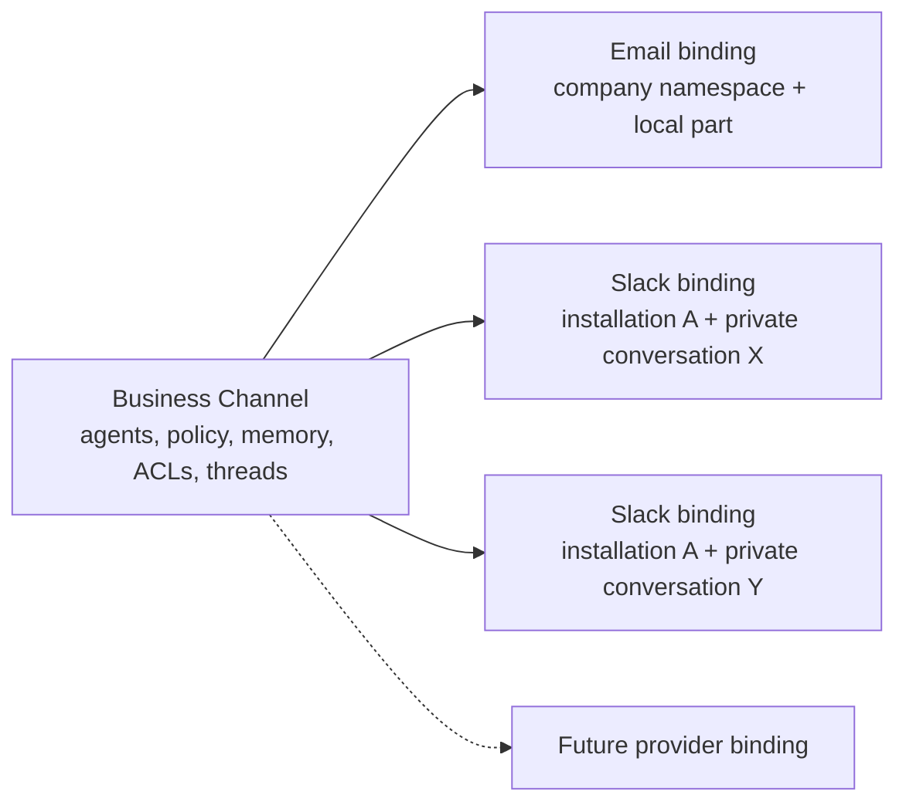
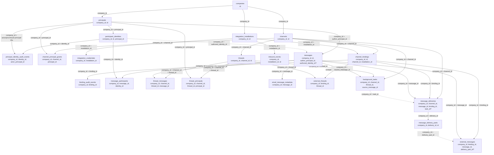
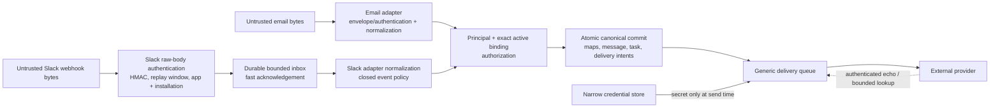
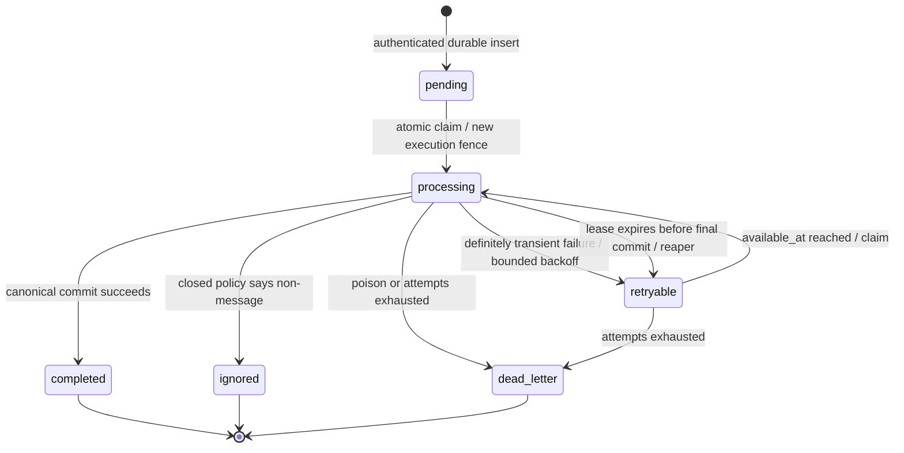
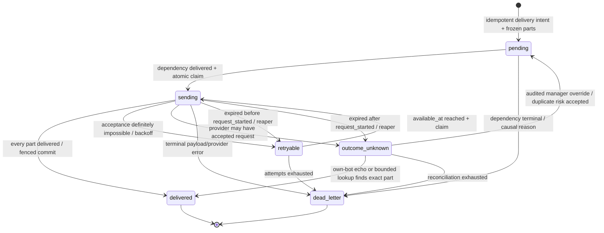
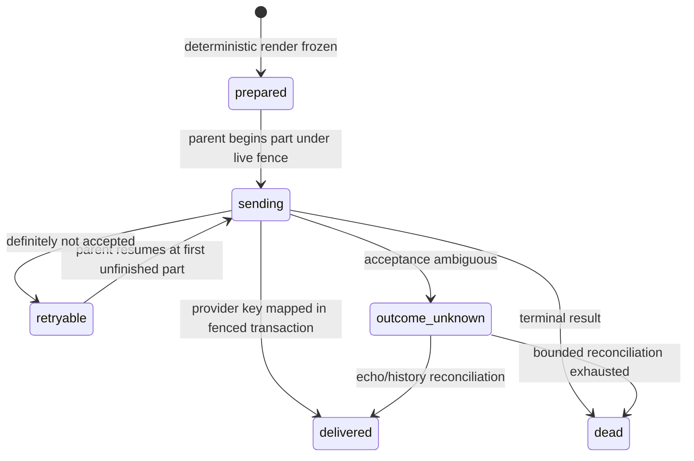

# Transport Architecture Contract

- Status: accepted
- Decision date: 2026-09-02
- Scope: canonical transport, identity, access, correlation, ingress, and delivery architecture
- Applies to: email, Slack v1, and later transport adapters

This decision record is normative. Later domain types, migrations, use cases, and adapters must
preserve the invariants in this document. A change that violates an invariant requires a new threat
model and an explicit amendment to this record before implementation.

## Glossary

| Term | Meaning |
|---|---|
| `Channel` | The company-scoped business object that owns agents, policy, memory configuration, threads, and access rules. |
| `TransportKind` | The supported interface family, initially `email` or `slack`. It replaces `ChannelType`; “channel” is reserved for the business object. |
| `ChannelBinding` | One independently addressable transport interface on a `Channel`. |
| `Principal` | A stable actor within one company: app user/person, agent, external person, or system actor. |
| `QualifiedIdentity` | A transport-qualified name for a principal, unique by `(transport, namespace, subject)`. The persisted identity row is `participant_identities`. |
| `ChannelSelector` | Transport-neutral intent to address a business channel; it resolves to a canonical channel ID. |
| External key | An opaque provider event, thread, or message key interpreted only by its adapter and qualified by the appropriate installation or binding. |
| Delivery | A durable intent to expose one canonical message through one destination binding. |
| Delivery part | One frozen provider request within a logical delivery, with a stable part ID and zero-based index. |

## Normative invariants

1. Every persisted relationship is company-scoped, and tenant ownership is enforced with composite
   foreign keys rather than inferred only in application code.
2. A `Channel` is not an email mailbox or Slack conversation. Email addresses and Slack conversation
   IDs are adapter-owned routing keys for bindings or selectors.
3. A binding owns no channel policy or message history. Pausing, disabling, orphaning, or unlinking
   a binding stops new ingress and egress through it without deleting the channel, its threads, or
   its canonical messages.
4. Principals are stable actors. Transport identities name principals but are not themselves access
   grants, team memberships, or proof that two actors are the same person.
5. Canonical messages contain no mandatory email or Slack fields. Protocol headers, raw provider
   representations, and provider correlation keys live outside `messages`.
6. External thread and message keys are opaque and binding-qualified. A canonical thread may have
   mappings in multiple bindings at once.
7. Ingress authorization requires an authenticated transport request, an active exact binding, and
   an eligible sender. Provider installation or event receipt alone is not authorization.
8. Canonical message creation, semantic deduplication, thread mapping, task creation, explicit
   delivery intents, and durable inbound-event completion are one fenced transaction where the
   transport uses a durable inbox.
9. Delivery planning never derives mirroring from a database notification. It creates durable,
   idempotent intents in the transaction that creates the message or command result.
10. Source exclusion compares binding IDs, not transport kinds. A message may mirror between two
    Slack bindings, but never echoes to its source binding.
11. A logical delivery may have multiple parts. Every provider result belongs to one stable part;
    no canonical message or parent delivery has a single provider-message field standing in for all
    parts.
12. Queue idempotency prevents duplicate intent creation. It cannot make a provider API exactly
    once. Any outcome that may have been accepted by Slack is `outcome_unknown` and is never blindly
    retried.

## Business channels and bindings

`Channel` remains the policy aggregate. One channel may simultaneously have its canonical email
binding, several Slack bindings, and later bindings for other chat providers. The binding stores
only interface concerns: transport, namespace or installation, endpoint key, display label,
lifecycle state, and explicit access/delivery policy selection.



A binding's namespace is the immutable scope its endpoint key is unique within: the provider
workspace for an installed transport, the company id for email. Neither a company slug nor a
deployment mail domain appears in a stored endpoint key, because both are editable or configured and
a durable key built from either goes stale when it changes.

An email alias is adapter routing syntax and resolves to the channel's email binding. A Slack
conversation ID resolves only within its installation. Neither value is the channel's identity.
`ChannelSelector` represents the application intent to call a channel and resolves to a canonical
channel ID before delivery. External destinations, such as a third-party email address, are modeled
separately and are never smuggled into `ChannelSelector`.

## Principals and qualified identities

A principal is unique only within its company and has one of four roles in the actor model:
person/app user, agent, external person, or system actor. A principal can have several qualified
identities. A qualified identity's uniqueness scope is:

```text
(company_id, transport, namespace, subject)
```

The company prefix is mandatory in persistence even though the conceptual transport name is
`(transport, namespace, subject)`:

- Email: a deployment/email namespace plus the adapter-normalized address. Email normalization is
  case-insensitive and belongs to the email adapter.
- Slack: the installation ID plus the immutable Slack user ID. Slack identifiers retain their
  provider-defined casing and are not email-normalized.

Observation may precede linking. The first observation atomically creates or reuses one
company-scoped external principal and its qualified identity. It does **not** create company
membership, a channel principal grant, or access to any other binding. Concurrent observations of
the same identity must converge through a uniqueness constraint and transactional upsert.

Slack profile email is optional display enrichment with `slack_profile_claim` provenance. It is not
a verified email identity and never causes an automatic merge. Only an authenticated app user or a
company manager can explicitly link it to a same-company person principal. Link and unlink events
write an append-only `principal_identity_audit_events` row containing the authenticated actor,
identity, prior and resulting principal association, reason, and time; collisions fail closed.

## Access and disclosure model

App UI reads retain both checks:

1. the person is a member of the company; and
2. the channel's principal ACL permits the requested capability.

An observed external identity or membership in a provider workspace satisfies neither check.

A provider conversation binding is a separate disclosure boundary. Slack v1 uses the explicit
grant `conversation_members_read_and_participate`: after a company manager confirms a binding,
every current or future human member of that private Slack conversation may read content mirrored
there and may submit eligible messages to that one business channel through Slack. This grant does
not provide app UI access or access to other channels. Conversation membership changes may widen
the audience without an app-side ACL edit; the confirmation screen must say so.

The confirmation transaction records the manager, workspace/installation, immutable conversation
identity, safe privacy/shared/threadability flags, bot membership, member count, selected business
channel, exact access policy, validation time, and confirmation time. It stores no token or message
body. A unique active-endpoint constraint, not the UI, prevents two channels from binding the same
installed conversation.

Slack v1 rejects all of the following, even if a caller attempts to override provider facts:

- public or org-wide/default conversations;
- Slack Connect, shared, externally shared, or pending-share conversations;
- archived, frozen, or non-threadable conversations;
- direct messages and multi-person direct messages;
- conversations in which the installed bot is not a member; and
- conversations for which the installation lacks required read, history, or write scope.

Provider drift to an unsupported kind pauses/orphans the binding without deleting history. Member
count drift is recorded but does not revoke the chosen conversation-membership grant.

For inbound Slack events, installation ownership proves only which company may inspect the event.
Authorization additionally requires an active exact conversation binding and an ordinary eligible
human sender who is a member of that bound private conversation. Bot/app messages, edits, deletes,
join/leave notices, broadcasts, and unknown subtypes are ignored or audited through a closed
allowlist. V1 routes an eligible human message to the channel's position-0 active agent.

## Canonical messages, threads, and correlation

`Message` contains only protocol-neutral information: company and message IDs, author principal,
optional authored identity, body, optional subject, attachments, role, direction, correlation ID,
content hash, and timestamps. It does not require an email address, RFC Message-ID, Slack user ID,
or Slack timestamp.

Email envelope/authentication data, RFC Message-ID, In-Reply-To, References, Thread-Index, and raw
MIME/text/HTML belong in `email_message_metadata` or an email projection. Adapters expose validated
external keys and email reference candidates; application code does not parse RFC syntax. Slack
raw event data remains in the short-lived inbound inbox and safe Slack rendering/provider data
remains in delivery parts and external maps.

Provider correlation is represented as follows:

| Transport | `external_thread_key` | `external_message_key` | Qualification |
|---|---|---|---|
| Slack | `thread_ts.unwrap_or(ts)` | `ts` | channel binding |
| Email | Adapter-selected RFC/Thread-Index thread key or validated reference candidate | normalized RFC Message-ID | email binding |

Both keys are opaque outside their adapter. `(binding_id, external_thread_key)` identifies at most
one canonical thread. `(binding_id, external_message_key)` identifies at most one canonical
message, while the same key text may safely occur in another binding.

A Message-ID is therefore not a company-wide identity. The case that settles it is inter-channel
delegation: when one channel's agent mails another, the same Message-ID is one *outbound* message
on the sending channel's binding and one *inbound* message on the receiving channel's, with
different bodies, directions and threads. The pre-canonical schema keyed one row on
`(company_id, message_id)` and had to demand that both writers produce byte-identical content,
which silently broke every delegation hop whose two halves disagreed. Qualifying the key by the
binding that carried it removes that coupling.

Reply-before-root is valid. The inbound transaction resolves or upserts the external thread map
before it creates the canonical message. Therefore a Slack reply received before its root creates
the canonical thread; the later root joins the same thread through the shared external thread key.
A repeated provider key with a different canonical content hash is a collision error, never an
update of previously accepted content.

## Delivery planning and provider semantics

The application computes explicit delivery intents from a versioned policy matrix. For ordinary
ingress this includes every eligible active binding except the source binding, plus direct
destinations required by the command. An agent reply is a direct delivery to its source binding and
may additionally mirror to other policy-eligible active bindings. Quiet/context-only messages,
system notes, approvals, schedules, outreach, replies, and mirrors each have an explicit policy
entry; role or direction heuristics do not silently make a new category deliverable.

Each `message_deliveries` row identifies one canonical message and one destination binding and has
a stable application idempotency key unique within that binding. Rendering freezes one or more
`message_delivery_parts` before the first provider call. Parts have stable IDs/keys and indexes,
and each successful Slack part stores its own timestamp and external-message mapping. Establishing
a new provider thread is an ordered dependency: the root delivery records the external thread map
before dependent replies become claimable.

The system guarantees durable at-least-once work processing with fenced leases and semantic
deduplication. It does not claim exactly-once provider delivery. In particular,
`chat.postMessage` has no assumed idempotency guarantee. A timeout, connection loss, malformed or
oversized success response, lease loss after the request starts, or crash across the provider/DB
commit boundary becomes `outcome_unknown`.

Unknown Slack results are reconciled by an authenticated own-bot echo or a bounded, rate-limited
history lookup using only registered non-secret metadata: installation, binding, delivery part ID,
and content digest. A match commits the normal success mapping. Bounded exhaustion dead-letters the
part for operator action; it never automatically reposts. A manual retry despite duplicate risk
requires company-manager confirmation and an audited reason.

## Application ports

The contracts above live in `src/application/transport`, in the layer that consumes them. Adapters
implement them; nothing under `src/adapters` declares an abstraction the application depends on,
and `the_application_layer_imports_no_adapter_framework_or_provider_type` fails the build if that
reverses. Its exception list is the remaining work, each entry naming the step that retires it.

| Contract | What it is | Who produces it | Who consumes it |
|---|---|---|---|
| `InboundDraft` | The same message before the interface that carried it is resolved: identical content, with the provider keys still unqualified. Email forces the split — one mail addressed to `support+billing@…` arrives on two bindings, so *which* is the source is a routing conclusion. `InboundDraft::bind` is the only way to qualify the keys | Protocol ingress adapter | Ingest use case |
| `InboundRouting` | What each recipient addresses: an ordered channel pipeline, a reserved platform name, or a person. The whole address grammar is applied producing this and none of it survives | Protocol ingress adapter | Address resolution phase |
| `InboundEnvelope` | One inbound provider message: qualified author, addressed identities, bounded canonical content, attachment metadata, binding-qualified event/message/thread keys, reply candidates, typed policy facts, correlation ID, protocol extension | `InboundDraft::bind` | Canonical commit, agent dispatch |
| `IngressPolicyFacts` | `Email(EmailIngressFacts)` / `TrustedApplication` / `InstalledConversation` | Protocol ingress adapter | Ingress guard phase |
| `ProtocolExtension` | Bounded, versioned email metadata, or a reference to an already-durable stored event | Protocol ingress adapter | Canonical commit |
| `InboundCommitRequest` / `InboundCommitOutcome` | Every row one accepted message makes durable together: claimed-event fence, thread associations, task, delivery intents | Ingest use case | `InboundMessageCommitter` |
| `DeliveryIntent` | Canonical message, source binding, destination binding or explicit external destination, purpose, stable key | `DeliveryPlanner` | Delivery queue |
| `DeliveryEnvelope` / `RenderedPart` | Versioned protocol-neutral content plus a typed, bounded adapter payload, produced only after destination resolution | `TransportRenderer` | `TransportSender` |
| `ProviderSendOutcome` | `Delivered` / `RetryAfter` / `Retryable` / `OutcomeUnknown` / `Terminal` | `TransportSender` | Delivery state machine |
| `ExecutionLease<Row>` | Row ID, execution UUID, owner, expiry — typed per queue | Queue claim | Every fenced transition |

Two properties are load-bearing. `TransportSender::send` returns a `ProviderSendOutcome` rather
than a `Result`, because an `Err` erases the difference between a definite refusal and an
ambiguous one, and only the second forbids an automatic retry. And a delivery's idempotency key is
derived from purpose, canonical message and destination — the destination included, because
deduplication is by `(destination_binding_id, key)` and an explicitly named external destination
has no binding id to separate it from another recipient of the same message.

Durable task payloads carry canonical identifiers only (`InboundTaskPayloadV1`: company, channel,
thread, source message, correlation). Workers reload current entities with tenant-scoped queries.
No entity snapshot, parsed email, or raw provider content enters `background_tasks.payload`.

The payload carries three non-identifier fields, and the line is deliberate: hop count, traced
channels and the reply-delivery choice are properties of the *delivery* rather than of the message,
so no stored row holds them. Guessing any of them breaks loop protection or mails out an answer a
user asked to keep in the app. Everything the commit wrote — body, author, recipients, headers,
threads — is reloaded, so a queued run can never replay a stale copy of it.

## The inbound commit

One accepted message is one transaction (`adapters/persistence/thread/inbound.rs`). In dependency
order it takes a transaction-scoped advisory lock on `(binding_id, message_key)`, recognises a
redelivery under that lock, then resolves or opens each thread, binds each interface's conversation
key, inserts the canonical payload with its participants and email extension, associates it with
every thread, writes one binding-qualified message mapping per interface, creates or reuses the
agent-dispatch task by canonical source message ID, and creates the immediate delivery fan-out.
They become visible together or not at all.

The lock is what makes the redelivery check safe: "is this already stored?" followed by an insert
is a check-then-act, and two simultaneous SMTP sessions would otherwise both pass the check. A
redelivery returns the first delivery's canonical and task IDs, opens no thread and enqueues
nothing; a repeated key carrying *different* content is a typed collision rather than a rewrite of
a message agents have already answered.

SMTP answers only after this commit returns. A message the platform decided not to route (an
auto-reply, a reserved-address answer, a thread past its turn limit) is accepted and dropped,
because a 5xx would make the sending server retry or bounce and both make the loop worse; a message
refused on its merits is a permanent 5xx; a failure of ours — a database outage above all — is a
transient 4xx, because the message is still in the sending server's queue and a 250 there would
acknowledge something nothing had stored.

## Slack representation and routing

The installed Slack bot represents the bound business channel. Agent display names may appear in
message text, but custom bot names/icons are not requested and do not create independently
mentionable Slack agents. A message in a bound conversation routes to the position-0 active agent;
later native Slack agent sessions require a separate product and threat-model decision.

Cross-channel delegation resolves a `ChannelSelector` to a same-company canonical channel ID.
Email may parse a platform address into that selector, but tools and use cases do not manufacture
an email address as the identity or internal routing mechanism for another channel.

## Table ownership

| Concern / owner | Tables | May contain | Must not own |
|---|---|---|---|
| Company actor directory | `principals`, `participant_identities`, `principal_identity_audit_events` | Stable actors, qualified transport identities, bounded claims/provenance, explicit link/unlink audit | Provider membership as global authorization; auto-link decisions |
| Channel authorization | `channel_principal_grants`, `thread_principals` | Principal capabilities and canonical thread participation | Mutable email-keyed authorization |
| Integration lifecycle | `integration_installations`, `integration_credentials`, `channel_bindings`, `binding_audit_events` | Provider tenant, narrow encrypted credential, endpoint, binding policy/lifecycle, audit snapshot | Channel policy/history; secrets in list projections or audit metadata |
| Canonical conversation | `threads`, `messages`, `message_participants`, `thread_messages` | Protocol-neutral content, authorship, participation, thread association | RFC headers, Slack timestamps, raw provider payloads |
| Email extension | `email_message_metadata` | RFC/envelope/authentication fields and retained raw email representation | Canonical authorization or cross-transport correlation |
| Provider correlation | `external_threads`, `external_messages` | Binding-qualified opaque keys mapped to canonical rows and delivery parts | Provider keys embedded in canonical rows |
| Durable inbound adapter boundary | `inbound_events` | Bounded authenticated raw event, safe header facts, lease/fence, classification | Credentials, signature headers, long-term canonical history |
| Generic delivery queue | `message_deliveries`, `message_delivery_parts` | Canonical destination intent or explicitly unattributed notification, frozen provider payload, lease/fence, per-part result | Secret credentials; partial canonical attribution; a single result field for multipart delivery |

`email_outbox` is gone: the generic delivery queue replaced it outright on the clean-reset premise,
so there is no email-shaped queue left to be an exception to this model. Legacy `email_messages` and
email-keyed participant columns remain only for an explicitly bounded
expand-backfill-cutover-contract transition.

## Tenancy and composite foreign keys

Every tenant-owned table carries `company_id`, including association and correlation tables where
it could otherwise be derived. Every referenced parent exposes a composite unique key such as
`UNIQUE (company_id, id)`, and every child uses the matching composite foreign key. Global IDs do
not substitute for tenant scoping in a query or constraint.



Required database proofs include, at minimum:

- a binding's channel and optional installation belong to the binding's company;
- an identity belongs to a principal in the same company;
- channel grants and thread participants cannot reference foreign principals;
- a message author, thread association, binding map, task source, delivery, and delivery part cannot
  cross company boundaries; and
- an installation/workspace cannot be silently reused by another company in Slack v1.

All persistence reads and mutations that accept an external ID predicate on the caller's
`company_id`. Cross-company IDs return not found and never create an audit event.

## Trust boundaries



- Slack authenticity is established over the exact bounded raw body with timestamp replay defense,
  app ID validation, and constant-time signature comparison before trusted JSON parsing. Durable
  storage precedes a successful event callback response.
- Email authentication/envelope facts are interpreted only by the email adapter. Public SMTP or
  webhook headers, including `X-MailAgents-*`, never establish trusted internal delivery.
- Manager sessions plus CSRF/origin protection authorize installation, identity-link, and binding
  changes. Provider metadata is re-fetched and validated immediately before binding confirmation.
- Credentials are encrypted, company/installation/kind scoped, omitted from broad entities and
  logs, and loaded through the narrow sender path only after lease ownership is rechecked.
- Canonical bodies, provider payloads, profile claims, and Slack mrkdwn remain untrusted content.
  They are bounded, decoded fallibly, and never interpreted as authorization or system commands.

## Inbound-event state machine

This is the required state model for generic inbound events and Slack Events API handling. Only
`processing` owns a complete live lease `(execution_uuid, owner, locked_at, lock_expires_at)`.
Every owner transition from `processing` is fenced by the execution UUID and a live lease. The
reaper may change only an expired row and must guard against a replacement execution.



`pending`, `retryable`, `completed`, `ignored`, and `dead_letter` have no lease fields. Slack's
`event_id` deduplicates delivery into the inbox; `(binding_id, ts)` separately deduplicates the
semantic canonical message. Completion of a handled message is part of the same transaction as
identity/thread resolution, external maps, canonical message, task, and delivery intents. A crash
before that commit leaves the event retryable; a crash after it produces a harmless duplicate.
`LISTEN/NOTIFY` may reduce latency but never chooses deliveries and is not required for recovery.

## Delivery and part state machines

Only a `sending` parent delivery owns a live lease. Parts never own independent leases; every part
mutation is joined through the parent's live execution fence.





A parent is `delivered` only when every part is delivered. Any unknown part keeps the parent
`outcome_unknown`; a dead part makes the parent `dead_letter`. Reconciliation and manual override
retain the original stable part ID, index, payload, and digest. Automatic retry of an unknown Slack
part is forbidden.

### Two decisions the email implementation settled

**`pending` and `retryable` are both claimable.** A failed attempt lands in `retryable` with its
backoff on `available_at`, rather than being reset to `pending`. The two are one claim predicate --
`DeliveryStatus::is_claimable`, which the partial index `message_deliveries_claimable_idx` and a
test are both derived from -- but they are distinct rows to a reader and to the stuck-work census:
"queued and never tried" and "tried and failed" are different things for a human to look at.

**Rejection bounces are standalone notifications on the same queue.** A bounce answers a message
the application deliberately refused to store, and an unknown company address has no tenant,
channel, canonical message, or binding to borrow. The attribution columns are nullable only as one
all-or-none group: a database check permits either a complete tenant-scoped tuple or no tuple plus
an explicit external destination and `notification` purpose. A separate partial unique index
deduplicates standalone `(transport, idempotency_key)` rows. Their frozen parts use the same claim,
lease, retry, ambiguity, and worker path as canonical deliveries; no detached SMTP task remains.

Reserved `_` address replies and account confirmation codes remain direct system-mail operations:
the former is generated during address preflight, and the latter must stay atomic with registration
before it can move to this queue.

Everything else with a channel behind it *is* on the queue, including the notices that used to be
fire-and-forget: an approval request and a stop notice are now written as system-authored canonical
messages in the thread they concern, in the transaction that queues their delivery. A task parked
on an approval nobody was told about is not a state this can reach any more, and the conversation
shows that a human was asked.

## Required sequence traces

### Email inbound and reply

1. **Authentication boundary:** the email adapter accepts bounded SMTP/webhook input, evaluates
   envelope and email authentication facts, and treats all public headers as untrusted.
2. **Principal and binding:** the normalized sender email becomes or resolves a qualified identity
   in the deployment/email namespace. Recipient adapter syntax resolves a `ChannelSelector`, then
   the canonical channel's active email binding. Company membership plus channel principal ACL (or
   the explicitly configured external participation policy) authorizes ingress.
3. **External thread key:** the email adapter supplies the RFC/Thread-Index key and ordered reply
   candidates. The application upserts `(email_binding_id, external_thread_key)` before message
   creation and maps the normalized RFC Message-ID as the external message key.
4. **Canonical commit:** one protocol-neutral human inbound message, thread association, principal
   participation, task for the position-0 active agent, and policy-selected delivery intents commit
   together. Email RFC/envelope fields go only to `email_message_metadata`.
5. **Delivery rows:** the agent answer creates one direct `reply` delivery to the source email
   binding and optional `mirror` deliveries to other eligible active bindings. Email rendering
   freezes one part with a deterministic RFC Message-ID.
6. **Recovery point:** provider acceptance known to be impossible is retryable under the fenced
   lease. A crash or transport result that may follow SMTP acceptance is recorded conservatively
   rather than claimed exactly once; provider Message-ID and durable state support reconciliation
   and operator handling.

### Slack inbound and reply

1. **Authentication boundary:** the Slack endpoint verifies timestamp, exact raw-body HMAC, app ID,
   and installed workspace before it durably stores `event_id` and returns 2xx. It performs no
   canonical ingestion or Slack API call inline.
2. **Principal and binding:** the worker resolves the exact active binding by installation and
   conversation ID. `(installation_id, immutable_slack_user_id)` resolves or observes the principal.
   The event must be an allowlisted ordinary human message from an eligible member of the bound
   private conversation.
3. **External thread key:** `thread_ts.unwrap_or(ts)`; external message key: `ts`, both opaque and
   qualified by the source binding. The external thread mapping is upserted before the message, so
   reply-before-root is safe.
4. **Canonical commit:** the fenced final transaction inserts or reuses the canonical human
   message, thread association, maps, participant, position-0-agent task, explicit fan-out, and
   completes the inbound event. An own-bot echo confirms delivery instead and creates no human
   message or task.
5. **Delivery rows:** the agent answer gets a direct `reply` delivery to the source Slack binding;
   policy may add mirrors to other bindings. Slack rendering freezes bounded parts, each with safe
   metadata and its own external timestamp mapping.
6. **Recovery point:** a pre-request or definitely rejected send is retryable. Any ambiguous
   post-start result is `outcome_unknown` and may be reconciled only by authenticated echo or
   bounded metadata lookup; it is never blindly reposted.

### Email-to-Slack mirror

1. **Authentication boundary:** authorization is settled at email ingress as above. Mirroring is
   allowed only because a manager previously created an active Slack binding with the audited
   private-conversation disclosure grant.
2. **Principal and binding:** the email qualified identity resolves to the canonical author
   principal. Source is the email binding; destination is a distinct policy-eligible Slack binding
   on the same company/channel. Slack profile or workspace identity matching is unnecessary.
3. **External thread key:** the canonical thread already has an email mapping. If it lacks a mapping
   for the destination Slack binding, the first mirror is a root whose successful part-0 `ts`
   becomes that binding's external thread key.
4. **Canonical message:** the existing email-origin canonical message is reused; no Slack-shaped
   copy is created.
5. **Delivery rows:** one `mirror` delivery targets the Slack binding, with frozen parts. Later
   deliveries for the same canonical thread/binding depend on the root delivery and reply beneath
   its stored `ts`. The source email binding is excluded from mirror fan-out.
6. **Recovery point:** root success atomically records part `ts`, external-message map, and external-
   thread map before unblocking dependents. An ambiguous root is `outcome_unknown`; dependents wait
   while echo/history reconciliation searches by safe part metadata.

### Slack-to-email mirror

1. **Authentication boundary:** raw Slack event authentication, installed-workspace lookup, exact
   active binding, closed human-message policy, and conversation-member grant all succeed before
   canonical visibility.
2. **Principal and binding:** `(installation_id, Slack user ID)` resolves the canonical author
   principal. Source is the Slack binding; destination is the channel's distinct active email
   binding when its delivery policy permits mirroring. No profile-email auto-link is performed.
3. **External thread key:** Slack uses `thread_ts.unwrap_or(ts)`. The email renderer consults the
   destination binding's existing external-thread mapping/reply projection or establishes its own
   deterministic email thread representation; it never stores the Slack key as an email key.
4. **Canonical message:** the Slack-origin protocol-neutral message is reused. Email recipients and
   RFC headers are an adapter projection, not canonical fields.
5. **Delivery rows:** the inbound transaction creates one `mirror` delivery to the email binding
   and any other eligible binding except the source Slack binding. The email delivery has one frozen
   part and deterministic part/RFC Message-ID.
6. **Recovery point:** canonical ingress and delivery creation recover under the inbound event
   fence. Email send recovery uses the generic delivery fence and its provider classification; it
   cannot cause an echo to the source Slack binding. Any later inbound email reply resolves through
   the email binding's own external maps into the same canonical thread.

## Deferred from Slack v1

The following are intentionally unsupported, not undecided migration details:

- Slack file ingestion, upload, or mirroring (text accompanying `file_share` may carry an explicit
  omission marker under the closed ingress policy);
- message edits, deletes, reactions, broadcasts, joins/leaves, and other non-ordinary subtypes;
- public, shared/Slack Connect, externally shared, DM, and MPIM conversations;
- native Slack sessions or separately mentionable bot identities for individual agents;
- automatic identity linking from profile email, display name, or any mutable provider claim; and
- provider-specific historical backfills beyond the explicit email expand/cutover migration.

Supporting any deferred item requires an explicit product decision, access/disclosure threat model,
state transition and recovery design, and amendment to this contract before schema or adapter work.
