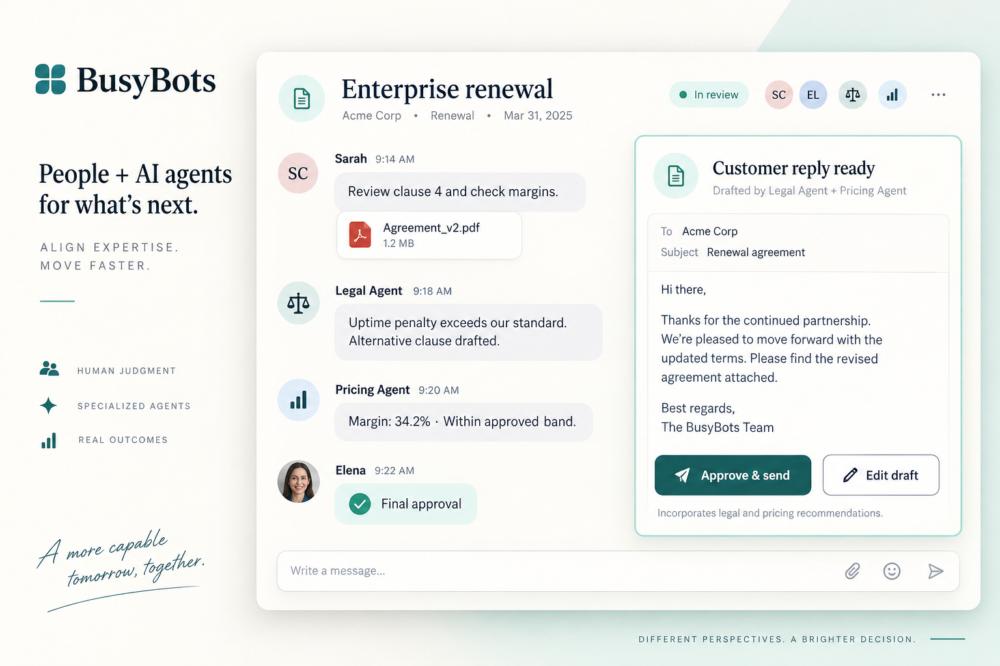
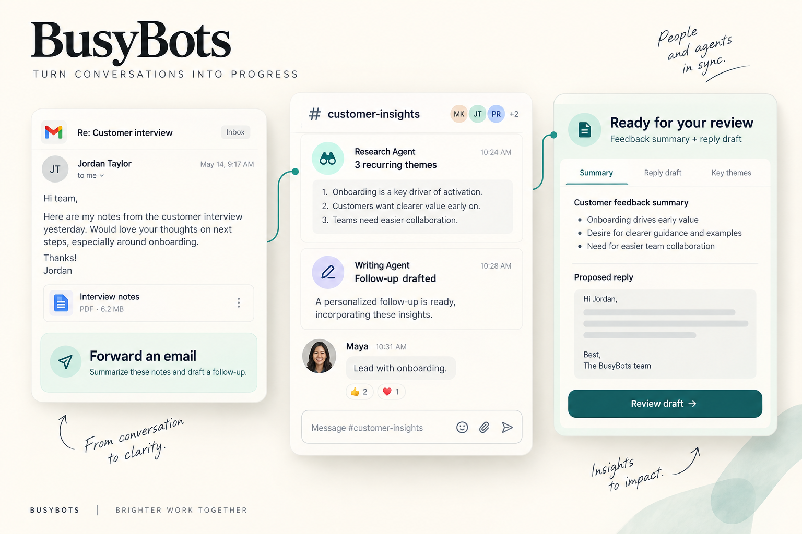
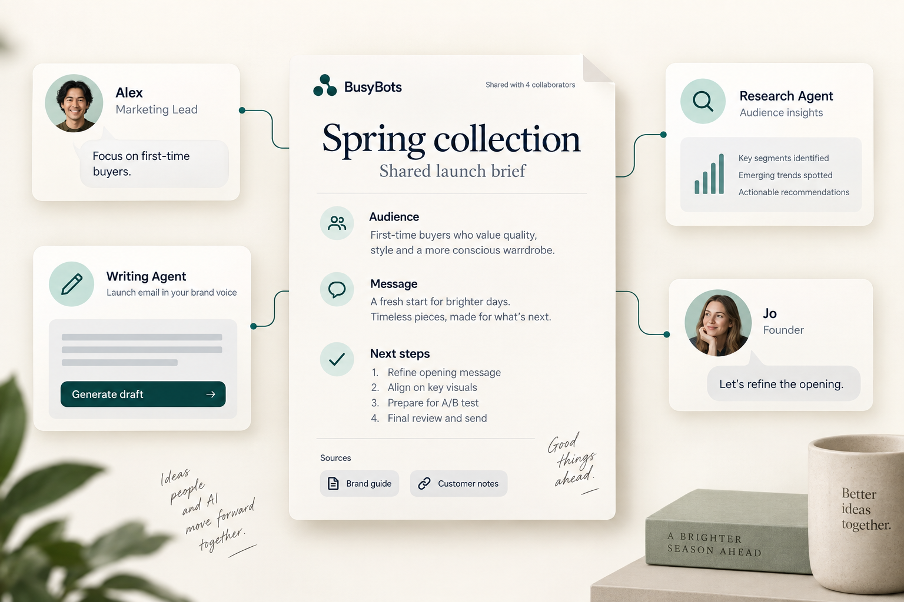
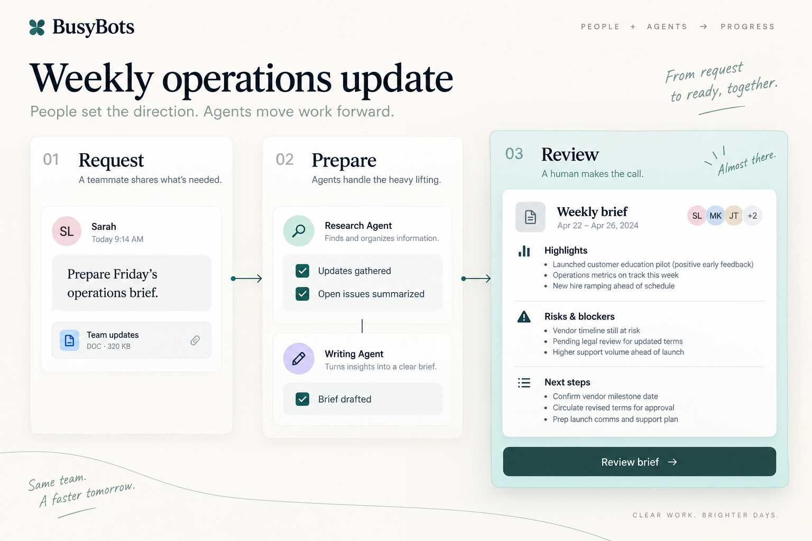
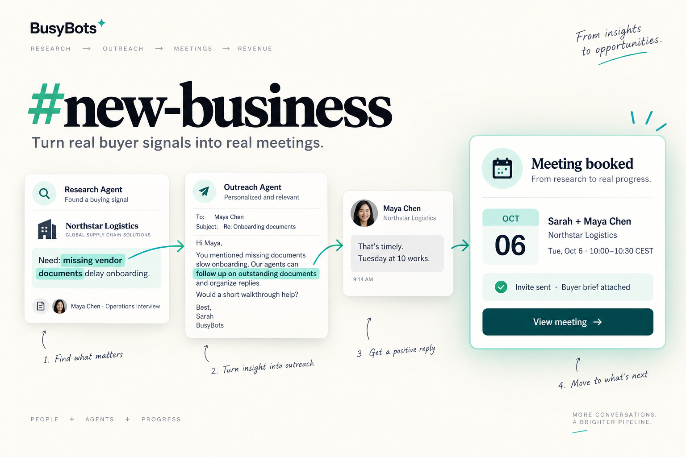

# Hero Section: Welcome to the Collaborative Intelligence

## 🌟 Eyebrow & Vision
*Welcome to the collaborative intelligence.*  
**Our Vision: Run your business. Not the busywork.**

---

## 🚀 Main Headline
# Leave busy work to BusyBots.

### Subheadline
**Redefining teamwork for the AI age.**  
Start company workspace with specialized AI agents. Shared channels or offices where teammates and agents share ideas, evolve plans and agents can take tasks to work on. Use BusyBots app online or just send or forward emails with instructions and attachments to get back results from your AI agent. Agents should handle the busy work, people should lead.

---

## 🎯 The Core Pillars

- **Shared Discussions & Company Knowledge**  
  Move beyond siloed 1:1 chatbots. Human teammates and AI agents collaborate in open, shared discussion threads grounded in your unified company knowledge.

- **Agents Think. People Lead.**  
  AI brings cognitive reasoning, synthesis, and tireless drafting. Humans provide the vision, strategic decisions, and final approval. Your brand voice and critical decisions always stay firmly in human hands.

- **Frictionless by Design: The Power of Email**  
  Email is essential for businesses environment, connecting them all —customers, vendors, partners, and internal teams alike. That's why we built on it from the start. It's also one of simple ways to connect with your agents. Zero software to install, zero client portals to log into. 

- **Deterministic Workflows & Proven SOPs**  
  Business should not rely on bots for deterministic execution. BusyBots pairs cognitive AI reasoning with deterministic execution graphs and standard operating procedures, ensuring every step, approval gate, and external integration is reliable, auditable, and repeatable.

---

## 📬 Primary Call to Action

```html
<div class="hero-cta-group">
  <a href="mailto:earlyaccess@busybots.ai?subject=Request%20Early%20Access%20to%20BusyBots&body=Hi%20BusyBots%20Team%2C%0A%0AI'd%20love%20to%20get%20early%20access%20for%20our%20team.%0A%0ACompany%20Name%3A%20%0ATeam%20Size%3A%20%0APrimary%20Use%20Case%20%2F%20Workflows%3A%20" class="btn-primary">
    📧 Email Us to Get Early Access
  </a>
  <span class="cta-subtext">Send an email to <strong>earlyaccess@busybots.ai</strong> to join our private cohort.</span>
</div>
```

---

## 🖼️ Hero Visual Concept



```
┌─────────────────────────────────────────────────────────────────────────────┐
│  INBOX / SHARED DISCUSSION: "Enterprise Renewal & Custom SLA Review"        │
├─────────────────────────────────────────────────────────────────────────────┤
│  👤 Sarah (Account Exec) 10:14 AM                                           │
│  "Forwarding the client's redlined contract [Agreement_v2.pdf].             │
│   @legal-agent @pricing-agent please review clause 4 and check margins."   │
│                                                                             │
│  🤖 Legal Agent (SOP: Contract Review v3) 10:14 AM                         │
│  "Clause 4 introduces a 99.99% uptime penalty. Our standard SOP permits    │
│   up to 99.95% without VP sign-off. Drafted alternative amendment clause." │
│                                                                             │
│  🤖 Pricing Agent (Shared Company Knowledge: Enterprise Tier) 10:14 AM      │
│  "Calculated margin: 34.2%. Fits within approved Q3 commercial band."       │
│                                                                             │
│  ┌───────────────────────────────────────────────────────────────────────┐  │
│  │ 📋 PROPOSED CUSTOMER REPLY (DRAFT READY)                              │  │
│  │ "Hi David, thanks for the draft! We've reviewed clause 4..."          │  │
│  │ [ ✓ Approve & Dispatch ]  [ ✏️ Edit Draft ]  [ 💬 Add Internal Note ] │  │
│  └───────────────────────────────────────────────────────────────────────┘  │
│                                                                             │
│  👤 Elena (VP Ops) 10:16 AM                                                 │
│  clicks [ Approve & Dispatch ] ──▶ Sent to client via standard email.       │
└─────────────────────────────────────────────────────────────────────────────┘
```

---

## 🖼️ Hero Visual Concept — Version 2: One Email, Work Underway



**Direction:** An oversized email card leads into a compact shared workspace, ending in a finished draft. The composition makes email the entry point and useful work the payoff.

```text
  YOUR EXISTING INBOX              BUSYBOTS SHARED WORKSPACE
  ┌──────────────────────────┐    ┌─────────────────────────────────┐
  │ Fwd: Customer feedback   │    │ #customer-insights               │
  │                          │    │                                 │
  │ "Summarize these notes   │───▶│ Research Agent                  │
  │ and draft a follow-up    │    │ Identified 3 recurring themes.  │
  │ for our team to review." │    │                                 │
  │                          │    │ Writing Agent                   │
  │ 📎 Interview notes      │    │ Follow-up draft ready.          │
  └──────────────────────────┘    │                                 │
                                  │ 👤 Maya: "Lead with onboarding."│
                                  └────────────────┬────────────────┘
                                                   ▼
                                  ┌─────────────────────────────────┐
                                  │ YOUR TEAM'S NEXT STEP           │
                                  │ Feedback summary + reply draft  │
                                  │ [ Review draft ]                │
                                  └─────────────────────────────────┘
```

**Visual treatment:** Warm white background, crisp email typography, and one brand-color connector. Keep the initial instruction and final deliverable largest; intermediate agent updates are supporting detail. On mobile, stack the three stages vertically.

**Supporting line:** “Forward the email. Let your agents take it from there.”

---

## 🖼️ Hero Visual Concept — Version 3: A Team Around Your Goal



**Direction:** A shared project brief sits at the center of a team constellation. Human comments and specialist contributions surround the same document, making collaboration and shared context visible at a glance.

```text
                         👤 Alex · Marketing Lead
                       "Focus on first-time buyers."
                                    │
                                    ▼
  ┌──────────────────────┐   ┌────────────────────────┐
  │ Research Agent       │   │ SHARED LAUNCH BRIEF    │
  │                      │──▶│                        │
  │ Audience insights    │   │ Spring collection      │
  │ from customer notes  │   │                        │
  └──────────────────────┘   │ Audience · Message     │
                             │ Channels · Next steps  │
  ┌──────────────────────┐   │                        │
  │ Writing Agent        │──▶│ Grounded in:           │
  │                      │   │ 📎 Brand guide        │
  │ Launch email draft   │   │ 📎 Customer notes     │
  │ in your brand voice  │   └───────────┬────────────┘
  └──────────────────────┘               │
                                        ▼
                             👤 Jo · Founder
                           "The direction looks right.
                            Let's refine the opening."
```

**Visual treatment:** An editorial workspace with a large central paper card, small human portraits, and simple agent role icons. Use short connector lines and generous whitespace so the shared brief remains the focal point. On mobile, place the brief first and contributions underneath.

**Supporting line:** “Your people. Your agents. One shared direction.”

---

## 🖼️ Hero Visual Concept — Version 4: From Request to Ready for Review



**Direction:** A horizontal work board shows a single request progressing through a defined process. The final review card dominates the composition, placing the human decision at the end of visible agent work.

```text
  WEEKLY OPERATIONS UPDATE
  Requested by Sam · Sources: team updates + last week's report

  01 REQUEST RECEIVED       02 AGENTS PREPARE         03 YOU REVIEW
  ┌────────────────────┐   ┌────────────────────┐   ┌──────────────────────┐
  │ 👤 Sam             │   │ Research Agent     │   │ 📄 Weekly brief     │
  │                    │   │ ✓ Updates gathered │   │                      │
  │ "Prepare Friday's │──▶│ ✓ Open issues      │──▶│ Highlights           │
  │ operations brief  │   │   summarized       │   │ Risks & blockers     │
  │ for my review."   │   │                    │   │ Proposed next steps  │
  │                    │   │ Writing Agent      │   │                      │
  │ 📎 Team updates   │   │ ✓ Brief drafted    │   │ Ready for Sam        │
  └────────────────────┘   └────────────────────┘   │ [ Review brief ]     │
                                                    └──────────────────────┘

  PROCESS: Collect updates → Summarize → Draft → Human review
```

**Visual treatment:** A restrained board with numbered columns, quiet completion marks, and a larger, highlighted review card. Use a clear reading order and familiar document styling. On mobile, turn the columns into a vertical sequence with the review action fully visible.

**Supporting line:** “The preparation is handled. The decisions are yours.”

---

## 🖼️ Hero Visual Concept — Version 5: From Potential Buyer to Booked Meeting



**Direction:** A shared sales thread connects research into a buyer's specific needs, outreach tailored to those findings, and scheduling. Show the evidence behind the need and how it shapes the message. A prominent meeting confirmation is the payoff: agents handle the preparation and coordination so your team can focus on the conversation.

```text
  #new-business · Find our next customers
  ┌──────────────────────────────────────────────────────────────────────┐
  │ 👤 Sarah · Sales Lead                                               │
  │ "Find potential buyers at growing logistics companies. Research    │
  │ their specific needs, tailor outreach to each buyer, and book calls│
  │ in my available meeting slots. Use our approved outreach brief."   │
  ├──────────────────────────────────────────────────────────────────────┤
  │ Research Agent                                                      │
  │ "Northstar is expanding into two regions. In a recent interview,  │
  │ Head of Operations Maya Chen says vendor onboarding is slowed by │
  │ missing documents and repeated email follow-ups. They need a way │
  │ to collect those documents without adding more manual chasing."  │
  │ 📎 Buyer brief · Interview source · Specific needs                │
  │                                                                      │
  │ Outreach Agent · Email tailored to the research                     │
  │ "Hi Maya, you mentioned missing vendor documents are slowing     │
  │ onboarding as Northstar expands. Our agents can follow up on     │
  │ outstanding documents and organize replies for your team. Would │
  │ a short walkthrough focused on that workflow be useful?"        │
  │                                                                      │
  │ 👤 Maya · Buyer reply                                               │
  │ "That's timely. Happy to take a look. What times work next week?"  │
  │                                                                      │
  │ Scheduling Agent                                                    │
  │ "Offered Sarah's available slots. Maya confirmed Tuesday at 10."   │
  │                                                                      │
  │ ┌────────────────────────────────────────────────────────────────┐ │
  │ │ MEETING BOOKED                                                 │ │
  │ │ Sarah + Maya Chen · Northstar Logistics                        │ │
  │ │ Tuesday, October 6 · 10:00–10:30 AM CEST                        │ │
  │ │ Calendar invite sent · Buyer brief attached                    │ │
  │ │ [ View meeting ]  [ Read buyer brief ]                         │ │
  │ └────────────────────────────────────────────────────────────────┘ │
  └──────────────────────────────────────────────────────────────────────┘
```

**Visual treatment:** Make the meeting confirmation the largest, highest-contrast card, with the research and email exchange forming a compact trail above it. Highlight “missing documents” in the research and “follow up on outstanding documents” in the outreach with the same accent color to connect the need to the proposed help. Use a small company monogram, clear agent role labels, and a calendar date tile to make the outcome immediately recognizable. On mobile, preserve the thread order and give the meeting card the full width.

**Supporting line:** “Your agents start the conversation. You show up for the meeting.”

---

## 🛡️ Hardened for the Business

- **Zero-Trust Side Effects:** Agents propose; deterministic workflow handlers execute.
- **Universal Compatibility:** Works with Google Workspace, Microsoft 365, SendGrid, Postmark, and custom SMTP.
- **BYOK AI Freedom:** Connect your own OpenAI, Anthropic, Gemini, Groq, or local Ollama models.
