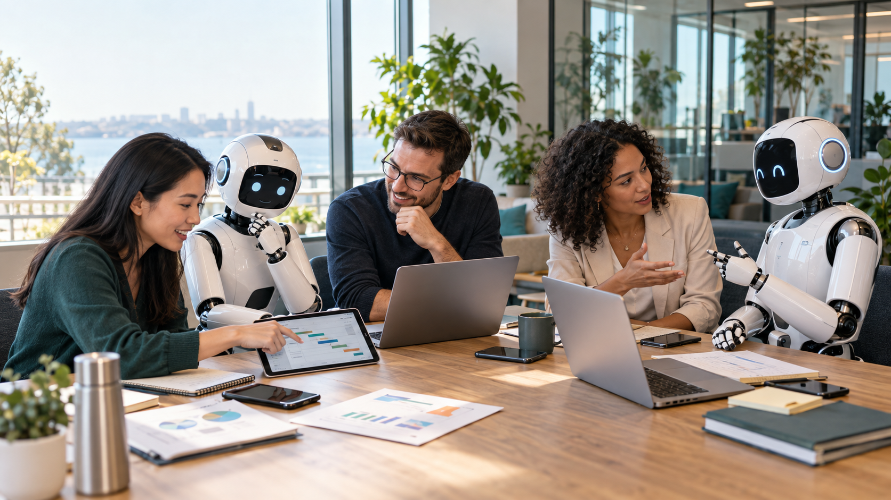

# Office collaboration hero

Generated using the built-in image generation tool.

## Prompt

Use case: ads-marketing. Asset type: BusyBots website hero image. Create a polished, warm, photorealistic editorial office scene of human employees and friendly physical AI robots collaboratively planning around one large meeting table. Landscape wide 16:9 composition. Four diverse adult coworkers and two sophisticated approachable robots are equal participants, naturally interacting and focused on a shared plan. One employee points at a tablet showing a simple visual project plan, a robot gestures thoughtfully toward it, another employee discusses an idea with the second robot. On the table clearly include open laptops, smartphones, and tablets, alongside a few paper planning notes and pens. Devices must be plausibly placed and physically accurate; screens show subtle abstract charts and planning layouts without readable text. Robots have refined white ceramic and brushed metal bodies with small expressive dark face displays, elegant proportions, no cartoon mascot styling, no intimidating industrial features. Bright contemporary office, oak meeting table, large windows, soft natural daylight, restrained teal accents, plants and glass partitions in background. Candid believable teamwork, thoughtful engaged expressions, premium commercial photography, realistic skin and materials, clean controlled composition, eye-level three-quarter wide camera angle. Leave some uncluttered breathing room in upper left for optional website headline overlay, but do not render any headline or text. The table and collaborative interaction are the focal point. No logos, no watermarks, no floating UI, no holograms, no handshake pose. Anatomically correct hands and robot joints; no duplicated devices or people.
