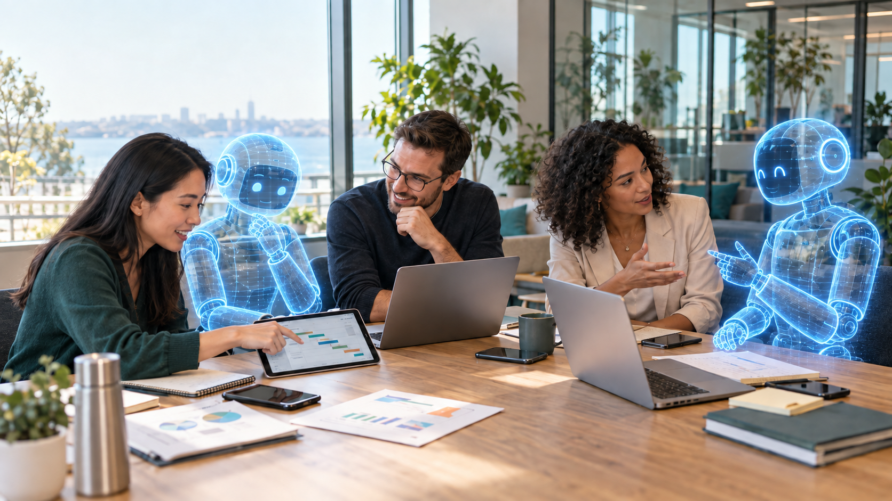

# Holographic office hero

Edited with the built-in image generation tool from `hero-office-collaboration.png`.

## Prompt

Edit the provided office hero image. Change ONLY the two robots into clearly nonphysical translucent blue high-tech holographic AI presences. Preserve their exact positions, sizes, silhouettes, friendly expressions and collaborative gestures. Replace ALL opaque white ceramic, black face panels, metal joints and physical surfaces of both bots with semi-transparent luminous cyan and electric-blue projected light. Office background must be visibly seen THROUGH their heads, torsos, arms and hands. Use delicate luminous contour lines, subtle wireframe details, fine horizontal holographic scan lines and a few tiny light particles, with softly fading lower edges. Friendly facial features are blue-white light suspended in transparent faces, not solid black screens. They should read immediately as virtual teammates projected into the room, not blue-painted physical robots or glass sculptures. Restrained sophisticated effect believable in daylight; soft blue glow near them without flooding the scene. Keep all three human employees, faces, hands, clothing, poses, laptops, smartphones, tablet, table, papers, windows, office background, daylight, camera framing and image aspect ratio exactly as in the input. No new objects, no captions, no logos, no watermark. Preserve the photorealistic premium commercial-photo style of the rest of the scene.
