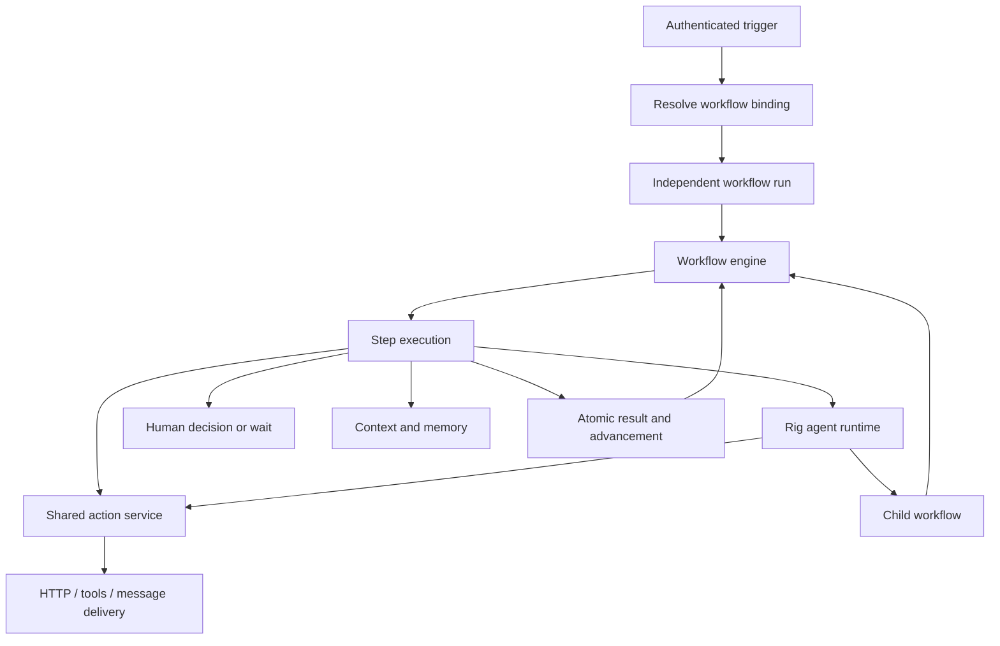

# 01 — Architecture and domain ownership

## Outcome and dependencies

Establish one execution model before adding handlers. No earlier SOP or workflow-library engine
is required. Existing task leases, Rig checkpoints, canonical messages, provider adapters,
authorization, and delivery records are foundations to refactor and reuse.

## Architecture

“Everything is a workflow” means configurable business processes. Authentication, ingress
validation, credential storage, leases, dispatch retries, and maintenance remain infrastructure.
Infrastructure must remain enforceable even when a company edits its workflow.

| Owner | Durable responsibility |
| --- | --- |
| Workflow/version | Graph, schemas, parameters, frozen dependency bundle |
| Binding/revision | Selected version, configured resources and parameters, admission state |
| Run | Input snapshot, progress, deadlines, budgets, parent relationship |
| Step execution | Resolved inputs, committed output, selected route, waiting reason |
| Background job/attempt | Scheduling, worker ownership, leases, retry timing |
| Agent checkpoint | Saved model turns, conversation, pending calls and continuation |
| Action invocation | Frozen authorized operation, idempotency identity and effect receipt |
| Human decision | Assignment, reviewed artifact, submitted choice/data, deadline and audit |
| Delivery | Provider-specific dispatch attempts and receipts |

Use normalized authoritative records and an append-only audit trail. Do not require event replay
to reconstruct current state. Avoid competing copies of run status in task payloads and UI tables.
Agent checkpoints may contain tool results for conversation replay, but action receipts own the
truth about whether an operation executed.

## Implementation

1. Add a workflow domain module for identifiers, definitions, graph validation, context resolution,
   and pure transition rules. Keep YAML parsing and storage serialization in adapters.
2. Add application workflow orchestration and cohesive ports for definitions, admission, run
   transitions, execution scheduling, and inspection. No adapter imports to access these ports.
3. Define typed step outcomes: completed output, durable wait request, or classified failure.
   Handlers do not choose arbitrary next nodes or enqueue their successors themselves.
4. Define run states `queued`, `running`, `waiting`, `succeeded`, `failed`, and `cancelled`.
   Waiting reasons distinguish decisions, events, timers, child runs, effects, and reconciliation.
   A business rejection can be a successful execution with a rejected result; it is not an
   infrastructure failure.
5. Put authorization and capability checks outside model prompts. All resource references are
   company scoped; related channel/thread visibility is checked independently.
6. Inventory the dispatch, scheduled dispatch, response-review, approval, outreach, agent-channel
   creation, executable-skill, and alternate-harness entry points. Assign each retained behavior
   to one owner above. Remove superseded paths in phase 8 instead of maintaining dual execution.
7. Preserve causal links among trigger, run, step, action, child run, and message. Correlation IDs
   are observability aids, never authorization or deduplication identities.

## Acceptance

- Every durable transition and effect has one authoritative owner and a purpose-specific port.
- No workflow handler owns transport retries or modifies another step's committed output.
- A message, schedule, manual start, and child call can be described by the same run model.
- The replacement map includes callers and UI projections, not just the main dispatch function.
